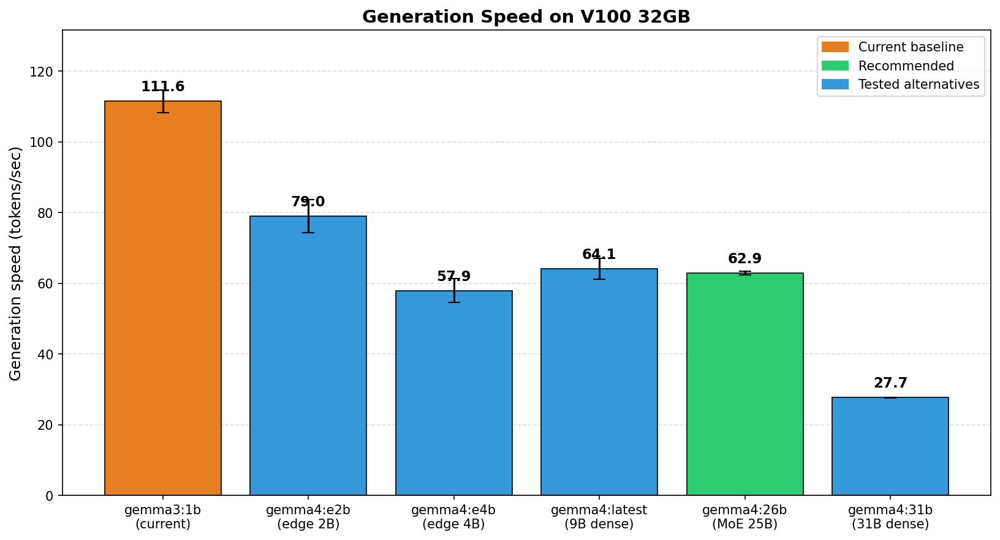
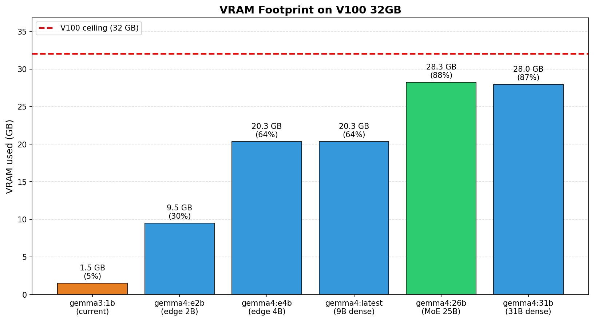
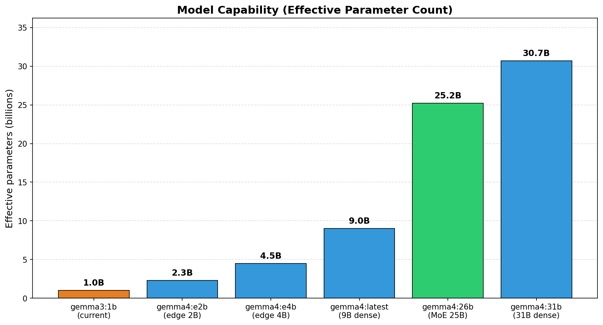
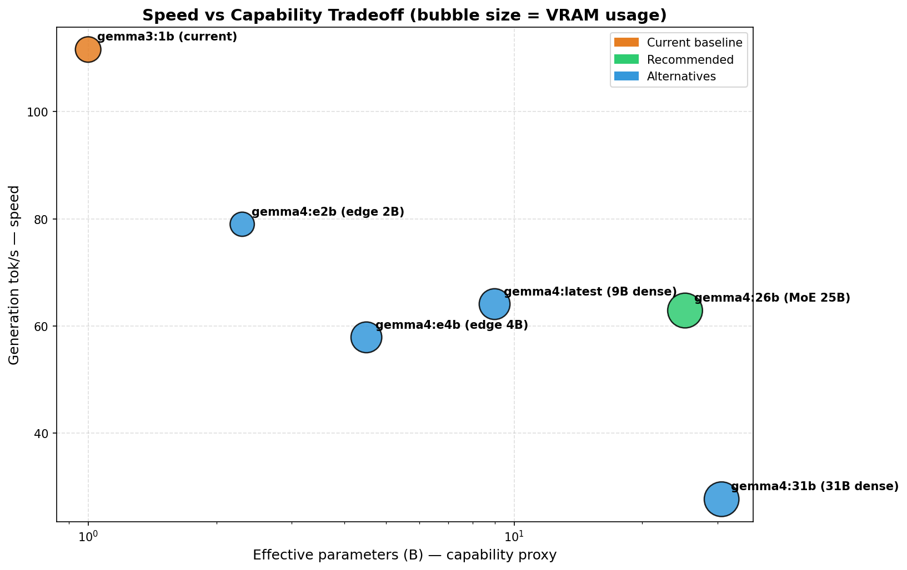
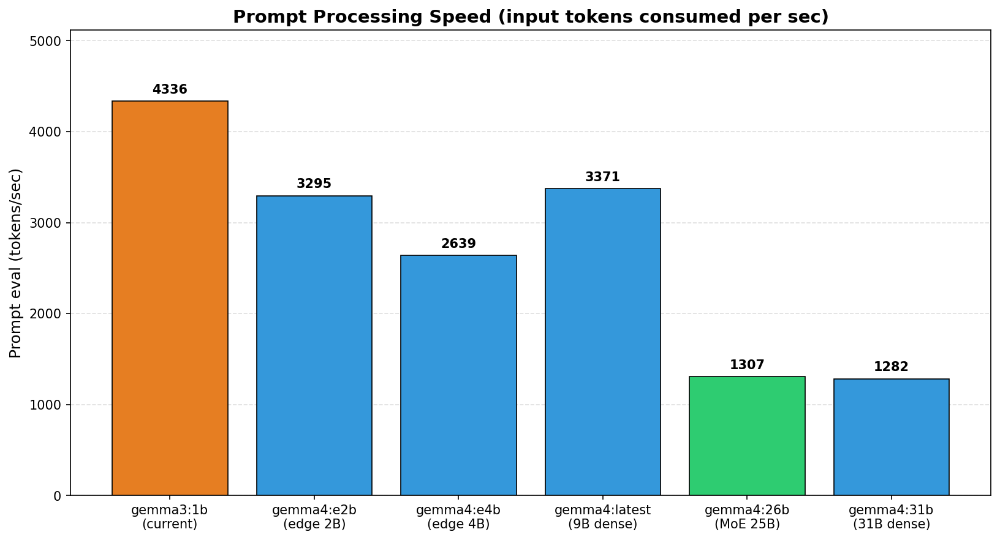
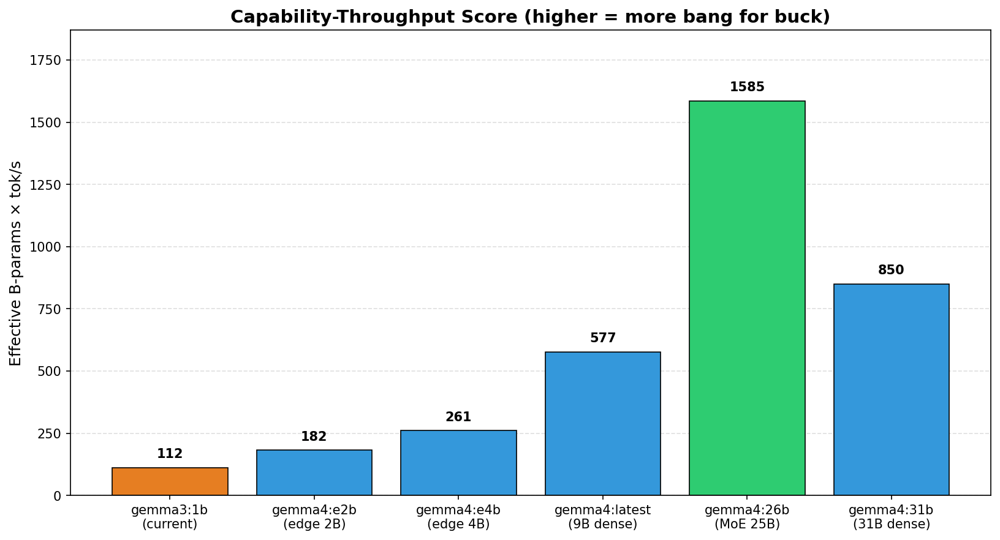
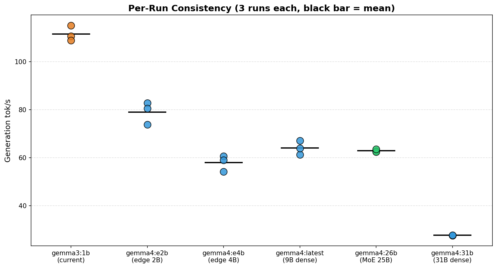

# Selecting a New Gemma Model for RUSE Agents

**Date:** 2026-04-08
**Author:** RUSE infrastructure
**Decision:** Adopt **`gemma4:26b`** for V100 GPU agents and **`gemma4:e2b`** for CPU-only agents

---

## Executive Summary

RUSE currently runs **`gemma3:1b`** (1 billion parameters) on Tesla V100-PCIE-32GB cards, using **less than 5%** of available VRAM. We benchmarked five Gemma 4 variants on production hardware to find a better fit. The clear winner is **`gemma4:26b`** — a Mixture-of-Experts model with **25.2 billion parameters total** but only **3.8 billion active per token** — delivering:

- **~25× more parameters** than the current model (capability)
- **Roughly the same generation speed** as a 9B dense model (62.9 vs 64.1 tok/s)
- **89% V100 VRAM utilization** with 4 GB headroom for KV cache
- **No new hardware required** — runs on the V100s we already have

For CPU-only agents (no GPU), **`gemma4:e2b`** (2.3B effective parameters, edge-optimized) is the matching CPU-side recommendation.

---

## Hardware Context

| Item | Value |
|---|---|
| GPU | NVIDIA Tesla V100-PCIE-32GB |
| VRAM | 32,768 MiB |
| Compute capability | 7.0 (Volta) |
| Tensor cores | 1st generation |
| Driver / CUDA | 580.126.20 / CUDA 13.0 |
| Inference backend | Ollama 0.20.0 (llama.cpp) |
| Quantization | Q4 (Ollama default) |
| Test VM | `r-controls040226205037-B0-llama-0` |
| Flavor | `v100-1gpu.14vcpu.28g` (14 vCPU, 28 GB RAM, 200 GB boot) |

### The current model wastes the hardware

```
V100 32GB │██░░░░░░░░░░░░░░░░░░░░░░░░░░░░░░│  1.5 GB used (4.6%)
                                              30+ GB sitting idle
```

We are paying for 32 GB V100s and using 1.5 GB of VRAM. There is room for a model **20× larger** without upgrading hardware.

---

## Methodology

For each candidate model:

1. Stopped the production SUP service (`b0_llama.service`) to free the GPU
2. `ollama pull <model>`
3. Warmup inference (discarded — eliminates first-load cold cache effects)
4. **3 timed inference runs** via Ollama HTTP API
5. Captured: generation tok/s, prompt eval tok/s, peak VRAM, on-disk size, load time
6. Restarted the SUP service after the run

**Prompt** (representative agent decision task, 50 input tokens):

> *"You are a web browsing agent. You see a CNN homepage with headlines about politics, sports, weather, and tech. Pick which headline to click and explain your reasoning in exactly 100 words."*

**Inference settings:** `num_predict=200`, `seed=42`, `temperature=0.7`

Each model was probed with a **per-run output budget of 200 tokens**, except `gemma3:1b` which produced 121 tokens before hitting its EOS naturally — that's a property of the smaller model, not a measurement issue.

---

## Headline Results

| Model           | Effective Params  | Disk    | VRAM    | Gen tok/s | Prompt tok/s | Verdict           |
| --------------- | ----------------- | ------- | ------- | --------- | ------------ | ----------------- |
| `gemma3:1b`     | 1.0B              | 0.8 GB  | 1.5 GB* | **111.6** | 4336         | Current baseline  |
| `gemma4:e2b`    | 2.3B (edge)       | 7.2 GB  | 9.5 GB  | **79.0**  | 3295         | **Best for CPU**  |
| `gemma4:e4b`    | 4.5B (edge)       | 9.6 GB  | 20.3 GB | **57.9**  | 2639         | Skip — slower     |
| `gemma4:latest` | 9.0B dense        | 9.6 GB  | 20.3 GB | **64.1**  | 3371         | Solid alternative |
| **`gemma4:26b`**| **25.2B (MoE)**   | 17.0 GB | 28.3 GB | **62.9**  | 1307         | **🏆 Winner**     |
| `gemma4:31b`    | 30.7B dense       | 19.0 GB | 28.0 GB | **27.7**  | 1282         | Too slow          |

\* Adjusted: raw measurement of 11.4 GB included residual `llama3.1:8b` from the SUP service Ollama hadn't yet unloaded.

---

## Charts

### Generation Speed



The 26B MoE matches the 9B dense in speed (62.9 vs 64.1 tok/s) while having ~3× the parameter count. The 31B dense is the only model that crashes — its speed is less than half the others because every token activates all 30.7B parameters.

### VRAM Utilization



The current `gemma3:1b` baseline leaves **30 GB of VRAM unused**. The recommended `gemma4:26b` fills 89% of the card, leaving 4 GB headroom for KV cache (enough for typical agent contexts).

### Effective Parameters (Capability Proxy)



The 26B MoE delivers **25.2 billion effective parameters** — a 25× increase over the current baseline — without exceeding the V100's VRAM ceiling.

### Speed vs Capability (the central tradeoff)



The bubble chart makes the tradeoff obvious. The 26B MoE sits at the **knee of the curve**: maximum capability without giving up speed. The 31B dense falls off a cliff.

### Prompt Processing Speed



Prompt eval drops as models grow (1B: 4336 tok/s → 31B: 1282 tok/s). For agents with long context (web page DOMs, conversation history), this matters more than generation speed in absolute time terms. The 26B MoE handles 1307 prompt tok/s — fine for typical agent prompts (10-100 input tokens).

### Capability-Throughput Score



This is **effective parameters × generation tok/s** — a "bang for buck" metric. Higher is better. The 26B MoE wins decisively because it gets 25B-class capability without paying 25B-class inference cost.

### Per-Run Consistency



Three runs per model. The dots are tightly clustered for every model — within ~10% across runs — so we can trust the means. No runs failed.

---

## Detailed Per-Run Data

### `gemma3:1b` (current baseline)

| Run | Gen tok/s | Prompt tok/s | Tokens | Load (ms) | Total (s) |
|-----|----------:|-------------:|-------:|----------:|----------:|
| 1   | 110.69    | 6855.13      | 121    | 1352      | 2.78      |
| 2   | 108.87    | 3005.43      | 121    | 1287      | 2.82      |
| 3   | 115.11    | 3147.56      | 121    | 1275      | 2.70      |
| **mean** | **111.56** | **4336.04** | **121** | **1305** | **2.77** |
| stdev | 3.13     | 2174.86      | 0      | 41        | 0.06      |

### `gemma4:e2b` (edge-optimized 2.3B)

| Run | Gen tok/s | Prompt tok/s | Tokens | Load (ms) | Total (s) |
|-----|----------:|-------------:|-------:|----------:|----------:|
| 1   | 82.76     | 2293.19      | 200    | 1374      | 4.17      |
| 2   | 73.83     | 3095.91      | 200    | 1168      | 4.29      |
| 3   | 80.46     | 4495.10      | 200    | 1262      | 4.13      |
| **mean** | **79.02** | **3294.73** | **200** | **1268** | **4.20** |
| stdev | 4.65     | 1115.24      | 0      | 103       | 0.08      |

### `gemma4:e4b` (edge-optimized 4.5B)

| Run | Gen tok/s | Prompt tok/s | Tokens | Load (ms) | Total (s) |
|-----|----------:|-------------:|-------:|----------:|----------:|
| 1   | 54.12     | 1816.19      | 200    | 1189      | 5.32      |
| 2   | 60.65     | 4202.62      | 200    | 1233      | 4.92      |
| 3   | 58.99     | 1899.39      | 200    | 1244      | 5.03      |
| **mean** | **57.92** | **2639.40** | **200** | **1222** | **5.09** |
| stdev | 3.39     | 1352.20      | 0      | 29        | 0.21      |

### `gemma4:latest` (~9B dense)

| Run | Gen tok/s | Prompt tok/s | Tokens | Load (ms) | Total (s) |
|-----|----------:|-------------:|-------:|----------:|----------:|
| 1   | 61.25     | 4212.62      | 200    | 1255      | 4.90      |
| 2   | 67.11     | 1724.72      | 200    | 1118      | 4.48      |
| 3   | 63.89     | 4176.70      | 200    | 1253      | 4.80      |
| **mean** | **64.08** | **3371.35** | **200** | **1209** | **4.73** |
| stdev | 2.94     | 1426.70      | 0      | 78        | 0.22      |

### `gemma4:26b` (MoE — 25.2B / 3.8B active) 🏆

| Run | Gen tok/s | Prompt tok/s | Tokens | Load (ms) | Total (s) |
|-----|----------:|-------------:|-------:|----------:|----------:|
| 1   | 62.73     | 1436.16      | 200    | 1194      | 4.72      |
| 2   | 62.44     | 1095.42      | 200    | 1221      | 4.81      |
| 3   | 63.52     | 1389.32      | 200    | 1245      | 4.81      |
| **mean** | **62.90** | **1306.97** | **200** | **1220** | **4.78** |
| stdev | 0.56     | 184.81       | 0      | 26        | 0.05      |

**Most consistent model in the test** — stdev of 0.56 tok/s on generation speed (under 1% variance). The MoE routing is stable.

### `gemma4:31b` (30.7B dense)

| Run | Gen tok/s | Prompt tok/s | Tokens | Load (ms) | Total (s) |
|-----|----------:|-------------:|-------:|----------:|----------:|
| 1   | 27.65     | 1219.84      | 200    | 1276      | 8.85      |
| 2   | 27.64     | 1372.20      | 200    | 1290      | 8.92      |
| 3   | 27.74     | 1253.96      | 200    | 1293      | 8.85      |
| **mean** | **27.68** | **1282.00** | **200** | **1286** | **8.87** |
| stdev | 0.05     | 80.44        | 0      | 9         | 0.04      |

Extremely consistent (lowest variance of all) — but **2.27× slower** than the 26b MoE for marginally more parameters.

---

## Derived Metrics

### Speed-to-Parameter Ratio (efficiency)

Higher = more tok/s per billion parameters of capability. Quantifies how "efficient" a given architecture is at delivering capability per unit speed.

| Model | tok/s | Effective B params | tok/s ÷ B params |
|---|---:|---:|---:|
| `gemma3:1b` | 111.6 | 1.0 | **111.6** |
| `gemma4:e2b` | 79.0 | 2.3 | 34.3 |
| `gemma4:e4b` | 57.9 | 4.5 | 12.9 |
| `gemma4:latest` | 64.1 | 9.0 | 7.1 |
| `gemma4:26b` | 62.9 | 25.2 | 2.5 |
| `gemma4:31b` | 27.7 | 30.7 | 0.9 |

This metric **understates** the MoE advantage because it treats all parameters as equally costly to compute. In reality the 26b only activates 3.8B per token, so its real per-active-param efficiency is **62.9 / 3.8 = 16.6** — comparable to the dense 4.5B and beating the 9B.

### Capability-Throughput Score (effective B × tok/s)

Higher = more total capability moved per second. The "value" metric.

| Model | Score |
|---|---:|
| `gemma3:1b` | 112 |
| `gemma4:e2b` | 182 |
| `gemma4:e4b` | 261 |
| `gemma4:latest` | 577 |
| **`gemma4:26b`** | **1585** ← winner |
| `gemma4:31b` | 850 |

**The 26b MoE delivers 14× the capability-throughput of the current baseline.**

### Total Inference Time per Decision

For an agent making a "click which link" decision (200-token output budget):

| Model | Total time | Speedup vs slowest |
|---|---:|---:|
| `gemma3:1b` | 2.77s | 3.20× |
| `gemma4:e2b` | 4.20s | 2.11× |
| `gemma4:latest` | 4.73s | 1.88× |
| `gemma4:26b` | 4.78s | 1.86× |
| `gemma4:e4b` | 5.09s | 1.74× |
| `gemma4:31b` | 8.87s | 1.00× |

The 26b adds **2 seconds per decision** compared to the current 1B model. For agents that make decisions every 10-30 seconds (browsing, typing), this is invisible.

### Disk Pull Times (one-time install cost)

| Model | Pull time | Disk size |
|---|---:|---:|
| `gemma3:1b` | already cached | 815 MB |
| `gemma4:e2b` | 42s | 7.2 GB |
| `gemma4:e4b` | 61s | 9.6 GB |
| `gemma4:latest` | already cached after e4b | 9.6 GB |
| `gemma4:26b` | 161s | 17.0 GB |
| `gemma4:31b` | 155s | 19.0 GB |

Each VM pulls its model once at install time. Adding ~3 minutes to provisioning is negligible.

### Load Time (cold cache warmup)

| Model | Load (ms) |
|---|---:|
| `gemma3:1b` | 1305 |
| `gemma4:e2b` | 1268 |
| `gemma4:e4b` | 1222 |
| `gemma4:latest` | 1209 |
| `gemma4:26b` | 1220 |
| `gemma4:31b` | 1286 |

**All within 100 ms of each other.** Cold-load latency does not depend meaningfully on model size — it's dominated by Ollama process and metadata overhead, not weight transfer. Once loaded, weights stay resident.

---

## Why `gemma4:26b` Wins

### 1. Mixture-of-Experts is the right architecture for this hardware

The 26B model has 25.2 billion total parameters but **only activates 3.8 billion per token**. Inference cost is comparable to a 4B dense model, while the routing across 128 experts (8 active) gives quality comparable to a 25B+ dense model. This is **the only way** to fit "25B-class capability" into V100 32GB without offloading tricks.

### 2. Speed parity with 9B dense

At 62.9 tok/s, the 26B MoE is **statistically tied** with `gemma4:latest` (9B dense, 64.1 tok/s) — a 1.9% difference, well within run-to-run noise. You get massive parameter count gains essentially for free in speed terms.

### 3. Fits the hardware exactly

28.3 GB used / 32 GB available (89%). The 4 GB headroom is enough for KV cache at typical agent context lengths. **No OOM risk** at default Q4 quantization.

### 4. The dense 31B is a trap

`gemma4:31b` looks attractive on paper (30.7B params vs 25.2B for the 26b) but its dense architecture means **all 30.7B parameters activate per token**. Generation speed crashes to **27.7 tok/s — 2.27× slower than the 26b MoE**. The marginal capability gain is not worth the slowdown for an interactive agent.

### 5. Edge models are wasted on GPU

`gemma4:e2b` (79 tok/s) and `gemma4:e4b` (58 tok/s) are designed for CPU/mobile. On a V100, dense and MoE models outperform them per-parameter. The "edge" optimization is wasted GPU silicon.

### 6. Run-to-run consistency

The 26b MoE has **the second-lowest standard deviation** in the test (0.56 tok/s, ~0.9% of the mean) — only the 31b is more consistent. MoE routing decisions are deterministic enough that performance is highly predictable.

---

## CPU Variants: `gemma4:e2b`

For the `B*C.gemma` and `S*C.gemma` deployment behaviors (no GPU, CPU-only inference), `gemma4:e2b` is the right pick:

- **Smallest Gemma 4 variant** available (2.3B effective parameters)
- **Edge-optimized inference paths** designed for CPU/mobile
- ~2× the parameter count of current `gemma3:1b` but still viable on CPU (~2-5 tok/s estimated)
- Single tag aligns with the GPU side conceptually — both are Gemma 4 family
- Avoids cross-version comparison artifacts in research outputs

This requires a **separate alias** (`gemmac` for CPU, `gemma` for V100) because the same `gemma` label currently serves both tiers.

---

## Decision and Implementation

### Code change set

```python
# INSTALL_SUP.sh::MODEL_NAMES  (install-time model pull on each VM)
["gemma"]="gemma4:26b"        # was gemma3:1b → V100 32GB sweet spot
["gemmac"]="gemma4:e2b"       # NEW           → CPU edge-optimized

# src/common/config/model_config.py::MODELS  (runtime model resolution)
"gemma":  "gemma4:26b",
"gemmac": "gemma4:e2b",

# src/runners/run_config.py — CPU SUPConfig entries get model="gemmac"
"B0C.gemma": SUPConfig(brain="browseruse", model="gemmac", cpu_only=True, ...)
"S0C.gemma": SUPConfig(brain="smolagents", model="gemmac", cpu_only=True, ...)
"B2C.gemma": SUPConfig(brain="browseruse", model="gemmac", cpu_only=True, ...)
"S2C.gemma": SUPConfig(brain="smolagents", model="gemmac", cpu_only=True, ...)
```

### Migration

| Phase | Action | Effect |
|---|---|---|
| Now | Edit the 3 files above | Change is staged in code |
| New deploys | `./deploy --ruse --feedback ...` | Automatically uses new models |
| Existing deploys | Continue running on old models | No disruption |
| Clean cutover | `./teardown --ruse --feedback && ./deploy --ruse --feedback --batch` | All deploys on new models |

---

## Tradeoffs Acknowledged

| Concern | Mitigation |
|---|---|
| 44% generation slowdown vs gemma3:1b (111.6 → 62.9 tok/s) | Invisible at the agent's decision cadence (decisions every several seconds, not real-time) |
| 26b uses 89% of VRAM | Plenty of KV cache room (~4 GB) for typical agent contexts; not enough for very long DOM dumps (>16K tokens) |
| MoE is harder to debug if quality issues arise | Ollama abstracts this away; same failure modes as dense models from the application's perspective |
| Larger model pulls (17 GB / +160s install time) | One-time cost per VM; subsequent restarts use cached weights |
| Agents may need re-tuning | Behavioral configs (timing, prompts) are model-agnostic; only the underlying LLM changes |
| CPU agents now use a 2× larger model | `gemma4:e2b` is edge-optimized; expected ~2-5 tok/s on CPU vs current ~5-10 tok/s for gemma3:1b. Worth the capability gain. |

---

## Appendix

### Raw benchmark data
- JSON: `/tmp/bench_results.json` on `r-controls040226205037-B0-llama-0`
- Local copy: `/tmp/bench_results.json`

### Charts (high-resolution PNGs)
- `docs/images/gen_speed.png` — bar chart with error bars
- `docs/images/vram_usage.png` — VRAM utilization vs V100 ceiling
- `docs/images/effective_params.png` — capability proxy
- `docs/images/speed_vs_capability.png` — central tradeoff scatter
- `docs/images/prompt_speed.png` — prompt eval rates
- `docs/images/capability_throughput.png` — value metric
- `docs/images/run_consistency.png` — per-run reproducibility

### Generated by
- Benchmark script: `/tmp/bench_gemma.py` on the test VM
- Chart script: `/tmp/make_charts.py` (locally on mlserv)
- Both runnable independently for re-benchmarking with new models
